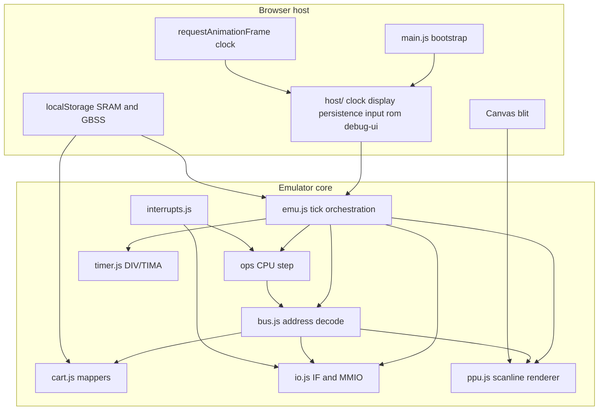

# Project review

**Date:** 2025-09-11  
**Updated:** 2026-09-14 — NR52 power-off stub; host split (`host/`); mapper header edge cases; timer module; frame remainder; per-scanline palette cache  
**Scope:** Architecture, code clarity, correctness, tests, tutorial/docs alignment, tooling, and repository hygiene.

---

## Executive summary

This is a strong tutorial codebase with a clear chapter progression, a well-tested CPU core, and a practical browser host. The default test suite is green (**765 pass, 65 skip, 0 fail**), lint and format checks pass, and Mooneye baseline matches the documented appendix 99 tally (**31 pass / 30 fail / 1 timeout**).

Remaining high-impact work is **Mooneye timing accuracy** (M-cycle CPU stepping, PPU/timer edge cases) per [course/99-mooneye-polish.md](../course/99-mooneye-polish.md). Mid-frame saves are documented as supported in [course/16-save-states.md](../course/16-save-states.md).

---

## Validation snapshot

| Check | Result |
| --- | --- |
| `bun test` (default) | 765 pass, 65 skip, 0 fail |
| `bun run lint` | Pass |
| `bun run format:check` | Pass |
| `bun run test:mooneye` | 31 pass, 30 fail, 1 timeout (expected baseline) |

---

## Findings by severity

### Medium — architecture and code clarity

| Topic | Issue | Suggested direction |
| --- | --- | --- |
| **Subsystem lifecycle** | Reset/serialize responsibilities are scattered | Introduce `reset()`, `step(tCycles)`, `serialize()`, `restore()` per subsystem |
| **CPU timing model** | Instructions run atomically | M-cycle stepping infrastructure (Fix 6 in appendix 99) unblocks 12 Mooneye CPU timing ROMs |
| **Bus vs PPU I/O** | PPU MMIO helpers live in `ppu.js` but routing and future access gating remain in `bus.js` | Keep bus facade; move mode-gating / restricted-access checks into PPU helpers |

---

### Medium — tooling, CI, and repository hygiene

| Topic | Issue | Remediation |
| --- | --- | --- |
| **7z extraction** | No file-count or size limits in [`archive7z.js`](../emu/src/archive7z.js) | Cap archive size, entry count, and decompressed bytes before extract |
| **Clipboard export** | [`host/debug-ui.js`](../emu/src/host/debug-ui.js) try/catch only; no fallback on non-HTTPS | Offer download link when `navigator.clipboard` is unavailable |

---

### Low — polish and accessibility

- Canvas and status messages lack `aria-live` / accessible names for screen readers.
- Keyboard shortcuts (`1`/`0` save/load) are undocumented in the UI (only in course ch. 16).
- `localStorage` quota errors from large save states are not handled gracefully.
- `test_carts/` (~5.2M, 133 test ROMs) inflates clone size; documented in README but not optional/submodule.

---

## Mooneye and accuracy (expected gaps)

Failures align with [course/99-mooneye-polish.md](../course/99-mooneye-polish.md):

| Category | Approx. count | Blocker |
| --- | --- | --- |
| CPU memory timing (`push_timing`, `jp_timing`, `call_timing`, …) | 12 | M-cycle memory access; atomic `push16` / `readImm16` |
| PPU timing (`lcdon_timing`, `stat_irq_blocking`, SCX stretch, …) | 9 | LCD-on delay, bus gating, STAT internal line, variable mode 3 |
| Timer edge cases | 8 | DIV→TIMA phase, reload quirks |
| OAM DMA | 1 timeout | `oam_dma/sources-GS` — external bus decoding |

These are documented future work, not regressions — but worth tracking if claiming “Mooneye polish complete.”

---

## Architecture map

**Dependency direction (good):** CPU → bus → cart/io/ppu. Host → emu only.

**Coupling to reduce:** PPU access restrictions and mode-gating still split between `bus.js` and `ppu.js`.

---

## Strengths worth preserving

1. **Chapter-aligned checkpoints** — `ch03`–`ch17` tests give learners verifiable milestones.
2. **Clear mental model** — `course/00-introduction.md` “one loop” diagram matches `tickEmu()` structure.
3. **Opcode organization** — Split under `emu/src/ops/` keeps the ISA teachable.
4. **Mooneye harness** — Opt-in suite with DMG filtering and serial decode is well designed.
5. **Reference layer** — `docs/reference/` complements Pan Docs without duplicating the course order.
6. **Save state format** — GBSS v1 is documented, versioned, and ROM-bound via CRC32 (payload and localStorage slot key).
7. **Host features** — 7z ROM pickers, deferred SRAM save, debug UI, and Game Boy shell layout are polished for a tutorial.
8. **APU stub contract** — NR52 power-off clears and write-gates `$FF10–$FF3F`; skip-boot seeds `$F1` ([`ch15-checkpoint.test.js`](../emu/test/ch15-checkpoint.test.js)).

---

## Recommended implementation sequence

1. **Host hardening** — 7z caps; clipboard download fallback.
2. **Timing infrastructure** — M-cycle CPU stepping (Fix 6), then timer and PPU Mooneye groups.
3. **Refactors** — subsystem lifecycle API; bus/PPU access-gating split.
4. **Repo hygiene** — optional `test_carts/` submodule/LFS if clone size becomes a problem.

---

## Subagent notes

- [Review tooling and quality](aad22767-75e5-49c3-8fa5-95f2f271251f) completed; CI, README, LICENSE, ROM policy, and GitHub Pages `base` since resolved.
- Architecture, tests, and tutorial subagents did not complete (resource limits); findings above were verified directly against the repo and test runs.

---

*Generated from a full-repository review session. Re-run Mooneye and default tests after further fixes.*
