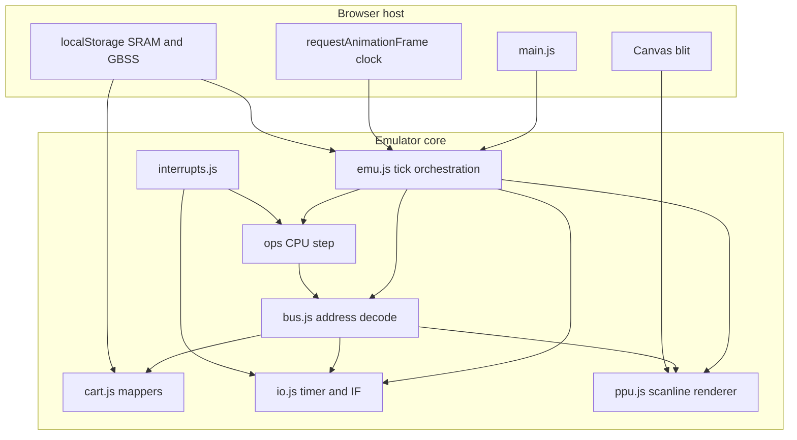

# Project review

**Date:** 2025-09-11  
**Updated:** 2026-09-13 — MBC2/ch17 checkpoint resolved; other fixed items removed  
**Scope:** Architecture, code clarity, correctness, tests, tutorial/docs alignment, tooling, and repository hygiene.

---

## Executive summary

This is a strong tutorial codebase with a clear chapter progression, a well-tested CPU core, and a practical browser host. The default test suite is green (**694 pass, 65 skip, 0 fail**), lint and format checks pass, and Mooneye baseline matches the documented appendix 99 tally (**31 pass / 30 fail / 1 timeout**).

Remaining high-impact work: **NR52 power-off write behaviour**, **GBSS save-state keying** (still title + header checksum), and **frame-boundary save enforcement**.

---

## Validation snapshot

| Check | Result |
| --- | --- |
| `bun test` (default) | 694 pass, 65 skip, 0 fail |
| `bun run lint` | Pass |
| `bun run format:check` | Pass |
| `bun run test:mooneye` | 31 pass, 30 fail, 1 timeout (expected baseline) |

---

## Findings by severity

### High

#### 1. APU stub — NR52 power-off behaviour

**Files:** [`emu/src/io.js`](../emu/src/io.js), [`course/15-host-polish-and-audio.md`](../course/15-host-polish-and-audio.md)

**Still open:** power-off register clearing on NR52 write (chapter 15 stub clears most APU regs when bit 7 is cleared); skip-boot does not yet seed `NR52 = $F1` in `skipboot.js`.

**Remediation:** Special-case `$FF26` write per chapter 15 stub; set post-boot NR values in `skipBoot()`; add a small unit test.

#### 2. Save states — frame boundary and keying

**Files:** [`emu/src/savestate.js`](../emu/src/savestate.js), [`emu/src/main.js`](../emu/src/main.js), [`course/16-save-states.md`](../course/16-save-states.md)

**Still open:** keyboard save (`1`) can occur mid-instruction (not frame-boundary only); GBSS `stateKey()` still uses title + 1-byte header checksum (SRAM keys use CRC32, save-state keys do not).

**Remediation:** Enforce save at frame boundary only, or document mid-frame saves as best-effort; migrate GBSS localStorage key to ROM CRC32 for consistency with SRAM.

---

### Medium — architecture and code clarity

| Topic | Issue | Suggested direction |
| --- | --- | --- |
| **Subsystem lifecycle** | Reset/serialize responsibilities are scattered | Introduce `reset()`, `step(tCycles)`, `serialize()`, `restore()` per subsystem |
| **Timer location** | `timerStep()` lives in `emu.js` | Move to `timer.js` (or `io.js`) for symmetry with PPU/joypad |
| **CPU timing model** | Instructions run atomically | M-cycle stepping infrastructure (Fix 6 in appendix 99) unblocks 12 Mooneye CPU timing ROMs |
| **Host monolith** | `main.js` is ~544 lines | Split into clock, persistence, input, display, debug modules |
| **Bus vs PPU I/O** | PPU register decode and future access gating live in `bus.js` | Keep bus facade; isolate PPU MMIO and mode-gating helpers |
| **PPU allocations** | `paletteShades()` recreated per background pixel | Cache per-line or per-palette-index arrays |
| **Frame boundary** | `runFrame()` may overshoot 70,224 T-cycles | Track remainder or stop at real frame end |
| **Mapper edge cases** | Header ROM/RAM tables omit larger codes; MBC5 bitmask assumes power-of-two ROM size | Extend tables; use modulo against actual ROM length |
| **`frameReady`** | Set at LY 144, never cleared or consumed by host | Clear after blit or remove if unused |

---

### Medium — tooling, CI, and repository hygiene

| Topic | Issue | Remediation |
| --- | --- | --- |
| **No CI** | No `.github/workflows` | Add workflow: `bun test`, lint, format:check, `vite build` |
| **No root README** | Onboarding starts at `course/00-introduction.md` only | Add README with goals, `bun install`, `bun dev`, `bun test` |
| **No LICENSE** | Legal status unclear | Add license + `THIRD_PARTY_NOTICES` for vendored test ROMs and reference dumps |
| **ROM policy mismatch** | Docs say repo never ships ROMs; many `.gb` files are tracked | Either document test ROM provenance or move to submodule/LFS |
| **Vite `base`** | Root-absolute asset URLs | Set `base` for subpath deploys (e.g. GitHub Pages) |
| **7z extraction** | No file-count or size limits | Cap entries and decompressed bytes before extract |
| **Clipboard export** | Requires secure context; no fallback | Try/catch with user-visible message or download link |

---

### Medium — documentation and pedagogy

| Topic | Issue |
| --- | --- |
| **Joypad doc error** | `docs/reference/io-registers.md` says OR nibbles; implementation and ch. 12 correctly AND |
| **Missing checkpoint tests** | Chapters 14 and 15 have no `chNN-checkpoint.test.js` (ch. 17 covered by `ch17-checkpoint.test.js`) |
| **Course vs code** | Chapter 12 shows `selectWrite: 0x30`; implementation uses `0x00` (both valid post-boot paths — document the choice) |

---

### Low — polish and accessibility

- Canvas and status messages lack `aria-live` / accessible names for screen readers.
- Keyboard shortcuts (`1`/`0` save/load) are undocumented in the UI (only in course ch. 16).
- `localStorage` quota errors from large save states are not handled gracefully.
- Reference dumps under `docs/` (~4.3M) inflate clone size; consider trimming or documenting as optional.

---

## Mooneye and accuracy (expected gaps)

Failures align with [course/99-mooneye-polish.md](../course/99-mooneye-polish.md):

| Category | Approx. count | Blocker |
| --- | --- | --- |
| CPU memory timing (`push_timing`, `jp_timing`, `call_timing`, …) | 12 | M-cycle memory access; atomic `push16` / `readImm16` |
| PPU timing (`lcdon_timing`, `stat_irq_blocking`, SCX stretch, …) | 9 | LCD-on delay, bus gating, STAT internal line, variable mode 3 |
| Timer edge cases | 8 | DIV→TIMA phase, reload quirks |
| OAM DMA | 1 timeout | `oam_dma/sources-GS` — external bus decoding |

These are documented future work, not regressions — but worth tracking if claiming “Mooneye polish complete.”

---

## Architecture map

**Dependency direction (good):** CPU → bus → cart/io/ppu. Host → emu only.

**Coupling to reduce:** PPU register logic and future access restrictions in `bus.js`; timer logic in `emu.js`.

---

## Strengths worth preserving

1. **Chapter-aligned checkpoints** — `ch03`–`ch16` tests give learners verifiable milestones.
2. **Clear mental model** — `course/00-introduction.md` “one loop” diagram matches `tickEmu()` structure.
3. **Opcode organization** — Split under `emu/src/ops/` keeps the ISA teachable.
4. **Mooneye harness** — Opt-in suite with DMG filtering and serial decode is well designed.
5. **Reference layer** — `docs/reference/` complements Pan Docs without duplicating the course order.
6. **Save state format** — GBSS v1 is documented, versioned, and ROM-bound via CRC32.
7. **Host features** — 7z ROM pickers, deferred SRAM save, debug UI, and Game Boy shell layout are polished for a tutorial.

---

## Recommended implementation sequence

1. **Remaining correctness** — NR52 power-off write, skip-boot APU values, GBSS key → CRC32.
2. **Save state contract** — Frame-boundary saves only (or document mid-frame as best-effort).
3. **Test and CI gaps** — `ch14`, `ch15` checkpoints; GitHub Actions with Bun.
4. **Timing infrastructure** — M-cycle CPU stepping (Fix 6), then timer and PPU Mooneye groups.
5. **Refactors** — Split `main.js`, timer module, PPU allocation fixes.
6. **Repo hygiene** — README, LICENSE, third-party notices, clarify ROM policy.

---

## Quick wins (≤1 hour each)

- Add minimal CI workflow running `bun test`, `bun run lint`, and `bun run format:check`.
- NR52 power-off write + skip-boot `$F1` seed; unit test for read/write contract.
- Migrate GBSS `stateKey()` to ROM CRC32 (match SRAM).
- Fix joypad OR vs AND doc in `docs/reference/io-registers.md`.

---

## Subagent notes

- [Review tooling and quality](aad22767-75e5-49c3-8fa5-95f2f271251f) completed; confirmed Vite `base` and clipboard/HTTPS concerns above.
- Architecture, tests, and tutorial subagents did not complete (resource limits); findings above were verified directly against the repo and test runs.

---

*Generated from a full-repository review session. Re-run Mooneye and default tests after further fixes.*
